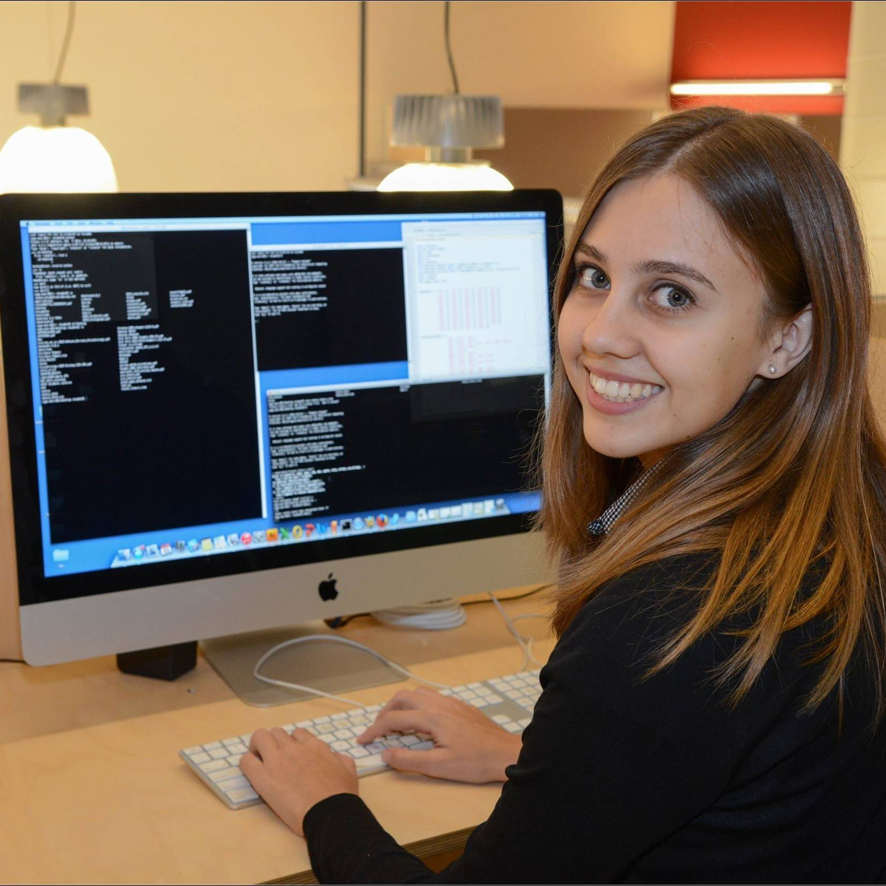

# About me

I am currently a PhD Candidate in Comparative Biology at the American Museum of Natural History's Richard Gilder Graduate School. I research new computational algorithms and their applications to genomic data, in order to enhance our understanding of evoultionary history. It has been rewarding to learn how to apply my computational skills to the pursuit of unknown frontiers in basic (fundamental) science. I plan to finish my PhD by September 2019.

I received my Bachelor of Science in Mathematical and Computational Biology from Harey Mudd College in 2015, with a concentration in Philosophy. I particpated in a wide variety of research projects, from ecological fieldwork, to computational genome assembly, to project design for educational mathematics games. The Harvey Mudd experience solidified my passion to work on interdisciplinary projects that benefit society, and to communicate my work effectively and responsibly to the public.

I am seeking employment for Fall 2019. I am interested in positions related to: data science, algorithm development, science communication and consulting.
